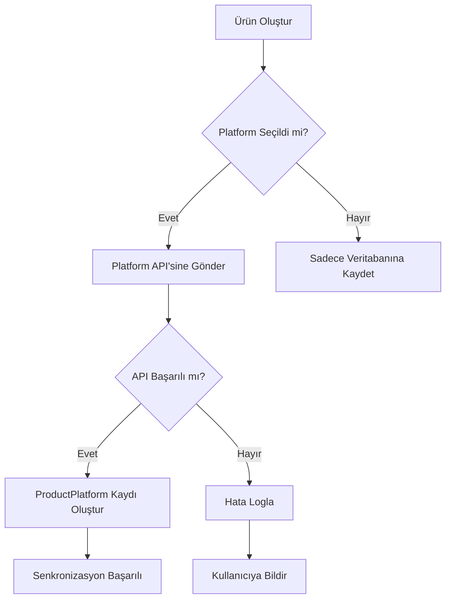

# 🛠️ E-Ticaret Entegrasyon Uygulama Rehberi

Bu dokümantasyon, projeye eklenen e-ticaret özelliklerinin teknik detaylarını ve uygulama rehberini içerir.

## 📋 İçindekiler

1. [Mimari Genel Bakış](#mimari-genel-bakış)
2. [Domain Layer](#domain-layer)
3. [Application Layer](#application-layer)
4. [Infrastructure Layer](#infrastructure-layer)
5. [API Layer](#api-layer)
6. [Platform Entegrasyonları](#platform-entegrasyonları)
7. [Frontend Entegrasyonu](#frontend-entegrasyonu)
8. [Deployment](#deployment)

## 🏗️ Mimari Genel Bakış

Proje, Clean Architecture prensiplerini takip eden katmanlı bir yapıya sahiptir:

```
Domain ← Application ← Infrastructure ← WebAPI
                                      ↓
                                  Angular Frontend
```

### Temel Prensipler

1. **Dependency Inversion**: İç katmanlar dış katmanlara bağımlı değildir
2. **Separation of Concerns**: Her katmanın kendi sorumluluğu vardır
3. **Testability**: Katmanlar bağımsız olarak test edilebilir
4. **Maintainability**: Değişiklikler izole edilmiş şekilde yapılabilir

## 🎯 Domain Layer

### Entities (Varlıklar)

#### Store (Mağaza)
```csharp
public class Store : BaseEntity
{
    public string Name { get; set; }
    public string? Description { get; set; }
    public int UserId { get; set; }
    public bool IsActive { get; set; }
    
    // Navigation Properties
    public virtual User User { get; set; }
    public virtual ICollection<PlatformIntegration> PlatformIntegrations { get; set; }
    public virtual ICollection<Product> Products { get; set; }
}
```

**Kullanım**: Bir kullanıcının sahip olduğu mağazaları temsil eder. Bir kullanıcı birden fazla mağazaya sahip olabilir.

#### PlatformIntegration (Platform Entegrasyonu)
```csharp
public class PlatformIntegration : BaseEntity
{
    public int StoreId { get; set; }
    public PlatformType PlatformType { get; set; }
    public string PlatformStoreName { get; set; }
    public string? ApiKey { get; set; }
    public string? ApiSecret { get; set; }
    public bool IsActive { get; set; }
    public DateTime? LastSyncDate { get; set; }
    public SyncStatus LastSyncStatus { get; set; }
}
```

**Kullanım**: Bir mağazanın e-ticaret platformlarıyla entegrasyonunu temsil eder. Her platform için ayrı API bilgileri saklanır.

#### Product (Ürün)
```csharp
public class Product : BaseEntity
{
    public string Name { get; set; }
    public string? SKU { get; set; }
    public string? Barcode { get; set; }
    public int CategoryId { get; set; }
    public int StoreId { get; set; }
    public decimal BasePrice { get; set; }
    public int StockQuantity { get; set; }
    public StockStatus StockStatus { get; set; }
    public PriceStrategy PriceStrategy { get; set; }
}
```

**Kullanım**: Mağazadaki ürünleri temsil eder. Platform bağımsız merkezi ürün bilgisi.

#### ProductPlatform (Ürün-Platform İlişkisi)
```csharp
public class ProductPlatform : BaseEntity
{
    public int ProductId { get; set; }
    public int PlatformIntegrationId { get; set; }
    public string? PlatformProductId { get; set; }
    public decimal PlatformPrice { get; set; }
    public int PlatformStockQuantity { get; set; }
    public bool IsListed { get; set; }
    public bool AutoSync { get; set; }
}
```

**Kullanım**: Bir ürünün hangi platformlarda listendiğini ve platform bazlı özel ayarlarını saklar.

#### Order (Sipariş)
```csharp
public class Order : BaseEntity
{
    public string OrderNumber { get; set; }
    public int PlatformIntegrationId { get; set; }
    public OrderStatus Status { get; set; }
    public decimal TotalAmount { get; set; }
    public string? CustomerName { get; set; }
    public string? TrackingNumber { get; set; }
}
```

**Kullanım**: Platformlardan gelen siparişleri merkezi olarak saklar.

### Enums (Sabitler)

#### PlatformType
```csharp
public enum PlatformType
{
    Trendyol = 1,
    Hepsiburada = 2,
    Amazon = 3,
    N11 = 4,
    CicekSepeti = 5
}
```

#### OrderStatus
```csharp
public enum OrderStatus
{
    Pending = 1,
    Confirmed = 2,
    Processing = 3,
    Shipped = 4,
    Delivered = 5,
    Cancelled = 6
}
```

#### StockStatus
```csharp
public enum StockStatus
{
    InStock = 1,
    LowStock = 2,
    OutOfStock = 3
}
```

## 📦 Application Layer

### Services (İş Mantığı)

#### IProductService
```csharp
public interface IProductService
{
    Task<IEnumerable<ProductDto>> GetAllProductsAsync(int storeId);
    Task<ProductDto> CreateProductAsync(CreateProductDto dto, int userId);
    Task<bool> UpdateStockAsync(int productId, int quantity, string changeType);
    Task<bool> SyncProductToPlatformAsync(int productId, int platformIntegrationId);
}
```

**Kullanım Örneği**:
```csharp
// Ürün oluşturma
var createDto = new CreateProductDto
{
    Name = "iPhone 15 Pro",
    SKU = "IPHONE15PRO-256-BLUE",
    BasePrice = 45000,
    StockQuantity = 100,
    CategoryId = 1,
    StoreId = 1
};

var product = await _productService.CreateProductAsync(createDto, currentUserId);

// Platforma senkronize et
await _productService.SyncProductToPlatformAsync(product.Id, trendyolIntegrationId);
```

#### IOrderService
```csharp
public interface IOrderService
{
    Task<IEnumerable<OrderDto>> GetAllOrdersAsync(int storeId);
    Task<bool> UpdateOrderStatusAsync(UpdateOrderStatusDto dto, int userId);
    Task<bool> SyncOrdersFromPlatformAsync(int platformIntegrationId);
    Task<decimal> GetTotalSalesAsync(int storeId, DateTime start, DateTime end);
}
```

**Kullanım Örneği**:
```csharp
// Platformdan siparişleri çek
await _orderService.SyncOrdersFromPlatformAsync(platformIntegrationId);

// Sipariş durumu güncelle
var updateDto = new UpdateOrderStatusDto
{
    OrderId = 123,
    Status = OrderStatus.Shipped,
    TrackingNumber = "TR123456789",
    CargoCompany = "Yurtiçi Kargo"
};

await _orderService.UpdateOrderStatusAsync(updateDto, currentUserId);

// Satış raporları
var totalSales = await _orderService.GetTotalSalesAsync(storeId, startDate, endDate);
```

### DTOs (Data Transfer Objects)

#### CreateProductDto
```csharp
public class CreateProductDto
{
    [Required]
    public string Name { get; set; }
    public string? SKU { get; set; }
    public string? Barcode { get; set; }
    public string? Description { get; set; }
    [Required]
    public int CategoryId { get; set; }
    [Required]
    public int StoreId { get; set; }
    [Required]
    public decimal BasePrice { get; set; }
    public decimal? CostPrice { get; set; }
    [Required]
    public int StockQuantity { get; set; }
}
```

## 🔧 Infrastructure Layer

### Repository Implementations

Tüm repository'ler IGenericRepository'den türer:

```csharp
public class ProductRepository : GenericRepository<Product>, IProductRepository
{
    public ProductRepository(DanistayDbContext context) : base(context)
    {
    }
    
    public async Task<IEnumerable<Product>> GetByStoreIdAsync(int storeId)
    {
        return await _dbSet
            .Where(p => p.StoreId == storeId && !p.IsDeleted)
            .Include(p => p.Category)
            .Include(p => p.ProductPlatforms)
            .ToListAsync();
    }
    
    public async Task<IEnumerable<Product>> GetLowStockProductsAsync(int storeId)
    {
        return await _dbSet
            .Where(p => p.StoreId == storeId && 
                       p.StockQuantity <= p.MinStockLevel &&
                       !p.IsDeleted)
            .ToListAsync();
    }
}
```

### Database Configuration

Entity Framework Core ile tablo yapılandırması:

```csharp
protected override void OnModelCreating(ModelBuilder modelBuilder)
{
    // Product Configuration
    modelBuilder.Entity<Product>(entity =>
    {
        entity.Property(e => e.BasePrice)
            .HasColumnType("decimal(18,2)")
            .IsRequired();
            
        entity.HasOne(p => p.Store)
            .WithMany(s => s.Products)
            .HasForeignKey(p => p.StoreId)
            .OnDelete(DeleteBehavior.Cascade);
            
        entity.HasIndex(e => e.SKU);
    });
}
```

## 🌐 API Layer

### Controller Implementation

#### ProductsController
```csharp
[ApiController]
[Route("api/[controller]")]
[Authorize]
public class ProductsController : ControllerBase
{
    private readonly IProductService _productService;
    
    [HttpGet("store/{storeId}")]
    public async Task<IActionResult> GetStoreProducts(int storeId)
    {
        var products = await _productService.GetAllProductsAsync(storeId);
        return Ok(new { success = true, data = products });
    }
    
    [HttpPost]
    public async Task<IActionResult> CreateProduct([FromBody] CreateProductDto dto)
    {
        var userId = int.Parse(User.FindFirst(ClaimTypes.NameIdentifier)?.Value ?? "0");
        var product = await _productService.CreateProductAsync(dto, userId);
        return CreatedAtAction(nameof(GetProductById), new { id = product.Id }, product);
    }
}
```

### API Response Format

Tüm API yanıtları standart formatta döner:

#### Başarılı Yanıt
```json
{
  "success": true,
  "data": {
    "id": 1,
    "name": "iPhone 15 Pro",
    "basePrice": 45000
  },
  "message": "İşlem başarılı"
}
```

#### Hata Yanıtı
```json
{
  "success": false,
  "message": "Ürün bulunamadı",
  "errors": ["Belirtilen ID ile ürün mevcut değil"]
}
```

## 🔌 Platform Entegrasyonları

### Platform API Service Interface

```csharp
public interface IPlatformApiService
{
    PlatformType PlatformType { get; }
    Task<bool> TestConnectionAsync(string apiKey, string apiSecret);
    Task<bool> PublishProductAsync(int productId, string apiKey, string apiSecret);
    Task<bool> UpdateProductStockAsync(string platformProductId, int stock);
    Task<List<object>> FetchOrdersAsync(string apiKey, DateTime? fromDate);
}
```

### Trendyol API Implementation Örneği

```csharp
public class TrendyolApiService : IPlatformApiService
{
    public PlatformType PlatformType => PlatformType.Trendyol;
    
    public async Task<bool> PublishProductAsync(int productId, string apiKey, string apiSecret)
    {
        var product = await _productRepository.GetByIdAsync(productId);
        
        var trendyolProduct = new
        {
            barcode = product.Barcode,
            title = product.Name,
            productMainId = product.SKU,
            brandId = 1,
            categoryId = 1,
            quantity = product.StockQuantity,
            salePrice = product.BasePrice,
            listPrice = product.BasePrice,
            description = product.Description,
            images = product.ProductImages.Select(i => new { url = i.ImageUrl })
        };
        
        using var client = new HttpClient();
        client.DefaultRequestHeaders.Add("Authorization", $"Basic {Convert.ToBase64String(Encoding.ASCII.GetBytes($"{apiKey}:{apiSecret}"))}");
        
        var content = new StringContent(JsonSerializer.Serialize(trendyolProduct), Encoding.UTF8, "application/json");
        var response = await client.PostAsync("https://api.trendyol.com/sapigw/suppliers/{supplierId}/v2/products", content);
        
        return response.IsSuccessStatusCode;
    }
}
```

### Platform Senkronizasyon Akışı



## 💻 Frontend Entegrasyonu

### Angular Service Örneği

```typescript
// product.service.ts
@Injectable({
  providedIn: 'root'
})
export class ProductService {
  private apiUrl = 'http://localhost:5235/api/products';
  
  constructor(private http: HttpClient) { }
  
  getStoreProducts(storeId: number): Observable<ApiResponse<ProductDto[]>> {
    return this.http.get<ApiResponse<ProductDto[]>>(`${this.apiUrl}/store/${storeId}`);
  }
  
  createProduct(product: CreateProductDto): Observable<ApiResponse<ProductDto>> {
    return this.http.post<ApiResponse<ProductDto>>(this.apiUrl, product);
  }
  
  syncProductToPlatform(productId: number, platformId: number): Observable<ApiResponse<any>> {
    return this.http.post<ApiResponse<any>>(
      `${this.apiUrl}/${productId}/sync/${platformId}`, 
      {}
    );
  }
}
```

### Component Örneği

```typescript
// product-list.component.ts
export class ProductListComponent implements OnInit {
  products: ProductDto[] = [];
  storeId: number = 1;
  
  constructor(private productService: ProductService) { }
  
  ngOnInit(): void {
    this.loadProducts();
  }
  
  loadProducts(): void {
    this.productService.getStoreProducts(this.storeId).subscribe({
      next: (response) => {
        if (response.success) {
          this.products = response.data;
        }
      },
      error: (error) => console.error('Error loading products', error)
    });
  }
  
  syncProduct(productId: number, platformId: number): void {
    this.productService.syncProductToPlatform(productId, platformId).subscribe({
      next: (response) => {
        if (response.success) {
          alert('Ürün başarıyla senkronize edildi');
        }
      },
      error: (error) => alert('Senkronizasyon hatası')
    });
  }
}
```

## 🚀 Deployment

### Prerequisites

1. .NET 9 SDK
2. SQL Server veya SQL Server LocalDB
3. Node.js 18+
4. Angular CLI

### Backend Deployment

```bash
# 1. Restore dependencies
dotnet restore

# 2. Build project
dotnet build --configuration Release

# 3. Run migrations
dotnet ef database update --project src/Danistay.Infrastructure

# 4. Publish
dotnet publish --configuration Release --output ./publish

# 5. Run
dotnet ./publish/Danistay.WebAPI.dll
```

### Frontend Deployment

```bash
# 1. Install dependencies
npm install

# 2. Build for production
ng build --configuration production

# 3. Serve with a web server
# The built files will be in dist/danistay-frontend/browser/
```

### Docker Deployment

```dockerfile
# Backend Dockerfile
FROM mcr.microsoft.com/dotnet/aspnet:9.0 AS base
WORKDIR /app
EXPOSE 80

FROM mcr.microsoft.com/dotnet/sdk:9.0 AS build
WORKDIR /src
COPY ["src/Danistay.WebAPI/Danistay.WebAPI.csproj", "src/Danistay.WebAPI/"]
RUN dotnet restore "src/Danistay.WebAPI/Danistay.WebAPI.csproj"
COPY . .
WORKDIR "/src/src/Danistay.WebAPI"
RUN dotnet build "Danistay.WebAPI.csproj" -c Release -o /app/build

FROM build AS publish
RUN dotnet publish "Danistay.WebAPI.csproj" -c Release -o /app/publish

FROM base AS final
WORKDIR /app
COPY --from=publish /app/publish .
ENTRYPOINT ["dotnet", "Danistay.WebAPI.dll"]
```

### Environment Configuration

#### Production appsettings.json
```json
{
  "ConnectionStrings": {
    "DefaultConnection": "Server=production-server;Database=ECommerceDb;User Id=sa;Password=***;"
  },
  "Jwt": {
    "Secret": "***STRONG_SECRET_KEY***",
    "Issuer": "ECommerceApp",
    "Audience": "ECommerceAppUsers",
    "ExpirationHours": 24
  },
  "PlatformSettings": {
    "Trendyol": {
      "BaseUrl": "https://api.trendyol.com",
      "Timeout": 30
    }
  },
  "Logging": {
    "LogLevel": {
      "Default": "Warning",
      "Microsoft.AspNetCore": "Warning"
    }
  }
}
```

## 🔒 Güvenlik

### API Key Yönetimi

API anahtarları **asla** kod içerisinde saklanmaz:

```csharp
// ❌ YANLIŞ
public const string TrendyolApiKey = "my-api-key-123";

// ✅ DOĞRU
var apiKey = _configuration["PlatformSettings:Trendyol:ApiKey"];
```

### JWT Token

```csharp
services.AddAuthentication(JwtBearerDefaults.AuthenticationScheme)
    .AddJwtBearer(options =>
    {
        options.TokenValidationParameters = new TokenValidationParameters
        {
            ValidateIssuer = true,
            ValidateAudience = true,
            ValidateLifetime = true,
            ValidateIssuerSigningKey = true,
            ValidIssuer = configuration["Jwt:Issuer"],
            ValidAudience = configuration["Jwt:Audience"],
            IssuerSigningKey = new SymmetricSecurityKey(
                Encoding.UTF8.GetBytes(configuration["Jwt:Secret"]))
        };
    });
```

## 📝 Testing

### Unit Test Örneği

```csharp
[Fact]
public async Task CreateProduct_ValidData_ReturnsProduct()
{
    // Arrange
    var mockRepo = new Mock<IProductRepository>();
    var mockUnitOfWork = new Mock<IUnitOfWork>();
    var service = new ProductService(mockRepo.Object, mockUnitOfWork.Object);
    
    var createDto = new CreateProductDto
    {
        Name = "Test Product",
        BasePrice = 100,
        StockQuantity = 10,
        StoreId = 1,
        CategoryId = 1
    };
    
    // Act
    var result = await service.CreateProductAsync(createDto, 1);
    
    // Assert
    Assert.NotNull(result);
    Assert.Equal("Test Product", result.Name);
}
```

## 🎯 Best Practices

1. **Always use DTOs**: Entity nesnelerini direkt API'de kullanmayın
2. **Async/Await**: Tüm I/O işlemlerinde async kullanın
3. **Exception Handling**: Global exception handler kullanın
4. **Logging**: Önemli işlemleri logla
5. **Validation**: FluentValidation kullanarak input validasyonu yapın
6. **Repository Pattern**: Database erişimini repository'ler üzerinden yapın
7. **Dependency Injection**: Loose coupling için DI kullanın

---

**Son Güncelleme**: 2025-11-16
**Versiyon**: 1.0.0
